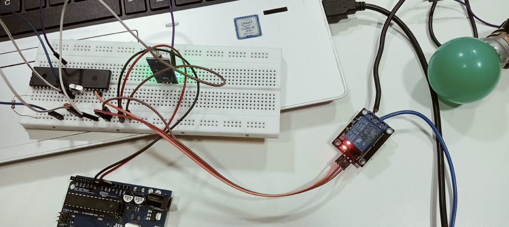
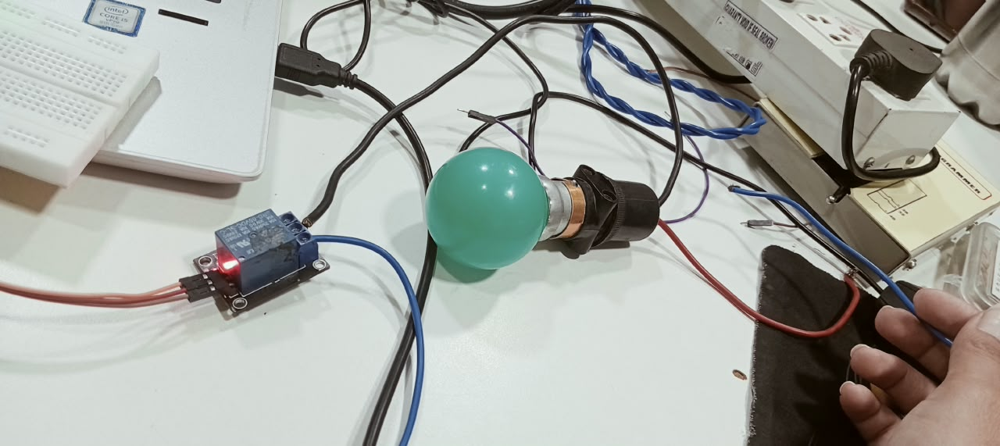

# Light Intensity Based Automatic Switching System

## Project Overview

This project is an automatic light control system developed using the PIC16F877A microcontroller, LDR sensor, and relay module.

The system detects surrounding light intensity using an LDR sensor and automatically controls an electrical light through a relay. During low-light or dark conditions, the light is switched ON automatically. When sufficient ambient light is available, the light is switched OFF.

## Tools and Technologies

- PIC16F877A Microcontroller
- Embedded C
- MPLAB X IDE
- XC8 Compiler
- LDR Sensor
- Relay Module
- AC Bulb / Electrical Load
- GPIO and Digital Input/Output

## Working

- The LDR sensor detects changes in ambient light intensity.
- The sensor output is provided to the RB0 input pin of the PIC16F877A.
- The microcontroller continuously monitors the input signal.
- When a low-light condition is detected, the RD0 output becomes HIGH.
- RD0 activates the relay, which switches the connected bulb/light ON.
- When sufficient light is detected, RD0 becomes LOW and the relay switches the light OFF.

## System Flow

LDR Sensor → PIC16F877A → Relay Module → Bulb / Light

## Key Concepts Implemented

- Sensor Interfacing
- GPIO Configuration
- Digital Input and Output
- Relay Interfacing
- Conditional Logic
- Automatic Light Control
- Basic Embedded System Design

## Applications

This system can be used in applications such as:

- Automatic Street Lighting
- Garden Lighting
- Outdoor Lighting
- Home Automation
- Energy-Saving Lighting Systems

## Source Code

The source code is available in the `main.c` file.

## Hardware Setup

## Project Demonstration

[View Project Demo](project-demo.mp4)
